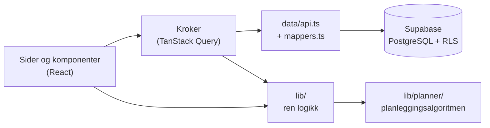

# Studieplanlegger

En personlig studieplanlegger som hjelper meg å behandle studiene som en jobb. Hver morgen forteller jeg når jeg starter, når jeg vil slutte og hvordan energien er, og appen lager en realistisk dagsplan i pomodoro-økter rundt forelesningene mine. Den prioriterer frister, fordeler tiden mellom fagene etter vekting og ukemål, og forklarer hvorfor planen ser ut som den gjør.

Laget for mitt første semester på ITØK ved Universitetet i Bergen, men fagene kan byttes ut hvert semester.

**Teknologi:** React · TypeScript · Vite · Tailwind CSS · Supabase (PostgreSQL, innlogging, Row Level Security) · TanStack Query · Vitest · Netlify

<!--
Skjermbilder: legg bildene i docs/screenshots/ og fjern kommentartegnene rundt linjene under.


-->

## Funksjoner

- **Morgenplanlegging.** Starttid, sluttid og energinivå gir en dagsplan i 50/10-økter (eller 45/10), med lunsj, forelesninger og en kort forklaring: *«Oblig 3 i MAT111 har frist i morgen, så den får 3 økter. MAT111 før lunsj, ITØK101 etter.»*
- **Oppgaver og frister.** Obliger med deloppgaver og fremdrift, stjerne for det som må prioriteres, fristlinje med nedtelling, og en rolig påminnelse når en oppgave er flyttet tre ganger.
- **Kalender.** Uke- og dagsvisning med faste (ukentlige) og engangs hendelser i fagfarger.
- **Fokus-timer.** Nedtelling med pausevarsel. Tiden logges automatisk på riktig fag og oppgave. En økt i planen godkjennes når det er logget nok tid i faget, uansett nøyaktig når.
- **Kveldsinnsjekk.** Helt, delvis eller ikke gjort for hver økt. Uferdige oppgaver kommer automatisk med i morgendagens plan.
- **Estimatlæring.** Sammenligner estimatene mine med faktisk tid per fag og oppgavetype (*«MAT111-øvingsoppgaver tar deg i snitt 30 % lengre tid enn du anslår»*) og justerer planleggingen automatisk.
- **Statistikk og ukesrapport.** Ukemål med timer per fag, streak, ukerytme og en nøktern ukesrapport på søndager med refleksjonsspørsmål.
- **Eksamensmodus.** Starter automatisk noen uker før første eksamen: høyere ukemål, temaer med trygghet (1–5) og viktighet, spaced repetition på temanivå, «klar for eksamen»-indikator, og en ærlig realismesjekk når tiden ikke strekker til.
- **Fungerer på PC og iPad**, og kan legges til på hjemskjermen som en app. Data synkes via Supabase.

## Arkitektur



Den viktigste designbeslutningen er at **all logikk ligger i rene TypeScript-funksjoner** i `src/lib/`, uten React og uten database. Komponentene henter data og viser resultatet, mens logikken kan testes alene.

```
src/
  lib/planner/     planleggingsalgoritmen (se under)
  lib/             kalender, oppgaver, tid, timer, godkjenning, estimater, streak, eksamen …
  data/            henting og lagring (api.ts) og oversetting database ↔ app (mappers.ts)
  components/      gjenbrukbare byggeklosser, ordnet etter side
  pages/           én fil per side
  focus/           fokus-timeren, som lever på tvers av sidene
supabase/migrations/   datamodellen som SQL
```

## Planleggingsalgoritmen

Algoritmen (`src/lib/planner/`) er regelbasert og deterministisk: samme input gir alltid samme plan, og hver regel har egne tester.

1. **Ledig tid.** Start til slutt, minus hendelser i kalenderen. Lunsj legges så nær ønsket tid som mulig.
2. **Økter.** Ledig tid deles i 50 min jobb og 10 min pause. En rest på minst 25 min blir en kortere økt. Lav energi gir ca. 70 % av øktene.
3. **Hva haster.** Frist innen 2 dager: får så mange økter som trengs. Frist innen en uke, eller stjerne: inntil halvparten av fagets økter. Gjenstående arbeid = estimat × personlig korreksjonsfaktor × andel deloppgaver som gjenstår.
4. **Hvilke fag.** Poeng per fag = andel etter vekting × (1 + 3 × hvor langt bak ukemålet faget er) + tillegg for det som haster. Ett fag før lunsj og ett etter. Dager med tre økter eller færre får bare ett fag.
5. **Rekkefølge.** Høy energi: det tyngste først. Lav energi: lesing og lettere arbeid først.
6. **Forklaring.** «Dagens prioritet» og ærlige advarsler hvis en frist ikke kan rekkes.

I eksamensmodus får fag med nær eksamen mer vekt (`1 + 14 / (dager igjen + 7)`), og temaer som skal repeteres blir egne repetisjonsøkter, prioritert etter `(6 − trygghet) × viktighet`.

En simulert uke uten frister gir MAT111 12,7 t, ITØK101 12,7 t og INFO132 6,3 t, altså omtrent 40/40/20 som vektingen tilsier. INFO132 blir valgt fra onsdag fordi faget ligger bak ukemålet.

## Datamodell og sikkerhet

Datamodellen er 13 tabeller i PostgreSQL (`supabase/migrations/0001_init.sql`): fag, hendelser, oppgaver, deloppgaver, dagsplaner, økter, tidslogger, innsjekker, ukesrapporter, eksamener, temaer og repetisjoner.

Nøkkelen som ligger i nettleseren er offentlig med vilje. Sikkerheten ligger i databasen: **Row Level Security** på hver tabell gjør at en innlogget bruker bare kan lese og endre rader der `user_id` er brukeren selv. Det er testet med to brukere mot en lokal PostgreSQL. Registrering av nye brukere er skrudd av.

## Testing

92 tester i 12 filer (Vitest) dekker den rene logikken: planleggingsalgoritmen, tid og tidssoner (sommertid!), kalender, godkjenning av økter, estimatlæring, streak, ukesrapport og eksamensmodus.

Noen feil testene fant underveis:

- Tidspunkt i norsk tid (`+02:00`) og UTC ble sammenlignet som tekst, slik at en økt kl. 01:05 så ut til å ha startet kl. 00:01.
- Et fag med 20 % vekting ble aldri valgt, selv når det lå langt bak ukemålet. Tillegget for å ligge bak ble gjort sterkere.

```bash
npm test
```

## Kom i gang lokalt

1. Lag et gratis prosjekt på [supabase.com](https://supabase.com), og kjør `supabase/migrations/0001_init.sql` i SQL Editor.
2. Lag en bruker under *Authentication → Users*, og skru av nye registreringer.
3. Kopier `.env.example` til `.env`, og fyll inn Project URL og Publishable key.
4. Start appen:

```bash
npm install
npm run dev
```

## Publisering

Appen er publisert på Netlify (`netlify.toml`). Miljøvariablene `VITE_SUPABASE_URL` og `VITE_SUPABASE_PUBLISHABLE_KEY` legges inn under *Site configuration → Environment variables*.

## Hva jeg lærte

<!-- Skriv noen linjer med egne ord: hva var vanskeligst, hva er du mest fornøyd med, hva ville du gjort annerledes? -->
